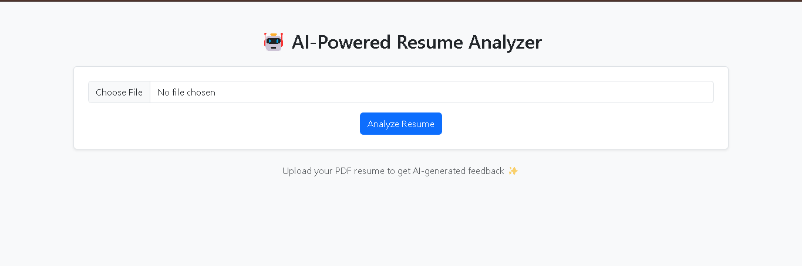
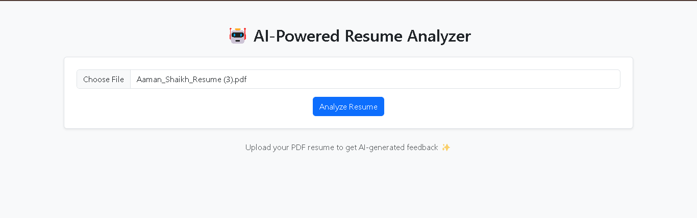
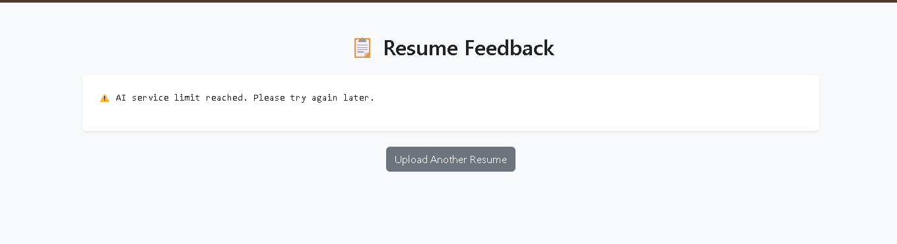

# 🤖 AI-Powered Resume Analyzer

A Flask-based web application that uses Google Gemini Pro AI to analyze resumes
and provide structured feedback on strengths, missing skills, improvements,
and overall impression. Designed to help students and job seekers prepare for
internships and jobs.

---

## 🚀 Features
- Upload resume (PDF or text)
- AI-based resume analysis using Google Gemini Pro
- Highlights strengths and missing skills
- Provides improvement suggestions
- Clean and simple web interface

---

## 🖼️ Screenshots

### Home Page


### Resume Upload


### AI Analysis Output


---

## 🛠️ Tech Stack
- Python
- Flask
- Google Gemini Pro API
- HTML, CSS
- Jinja2 Templates

---

## ⚙️ How to Run Locally

```bash
git clone https://github.com/Aamanshaikh786/Resume_Analyzer.git
cd Resume_Analyzer
pip install -r requirement.txt
python app.py
